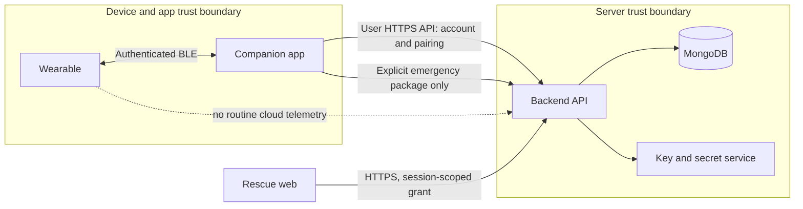
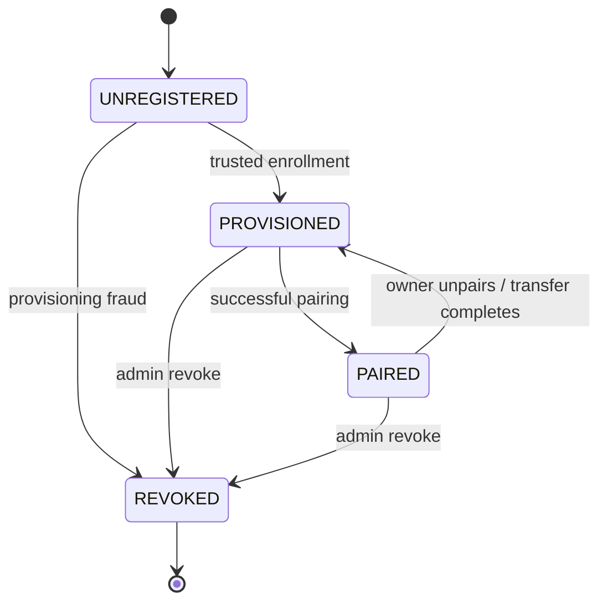
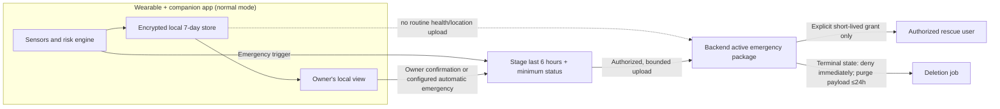

# Day 3 — Device and API Architecture

**Status:** Target architecture and implementation contract
**Scope:** SWAAS / TrailGuard wearable, companion app, backend, and rescue web
**Decision:** Privacy-first by default. This document defines intended behavior; it
does not claim that the current prototype already enforces every control.

## 1. Goals and non-goals

This design establishes component responsibilities, trust boundaries, device
identity and ownership, BLE and backend protocols, emergency sharing, API
contracts, data models, retention, and security tests. Implementation must
follow these invariants; a client-side check is never an authorization control.

The companion app is the normal owner of health and location data. The backend
is not a continuous telemetry sink in normal mode. An emergency is the only
default path for sharing a bounded data package with authorized rescue users.

This is a target architecture, not a description of all current behavior. The
repository has a React web dashboard and MongoDB-backed telemetry routes. The
backend now has a pairing-challenge API that verifies pre-provisioned Ed25519
device keys, consumes one-time bootstrap tokens, and atomically claims eligible
devices. A trusted provisioning CLI and browser QR/Web Bluetooth pairing flow
are implemented, but the browser flow has not been validated against physical
hardware. There is not yet an emergency-session API. Current telemetry routes
can still upload readings in normal operation using device ID/status lookup
rather than cryptographic device authentication. These are migration gaps, not
acceptable properties of the target design. Do not enable production telemetry
or emergency access until the corresponding controls and tests below are
implemented.

## 2. System components and trust boundaries

| Component | Responsibilities | May access | Must not do |
|---|---|---|---|
| Wearable | Sample sensors; run local risk detection; buffer a bounded amount of data; communicate with the paired app; raise signed emergency events | Its own sensors, device key, recent local telemetry and risk events | Treat `deviceId` as a credential; upload continuous health/location data in normal mode; accept unauthenticated control commands |
| Companion app | Authenticated user interface; BLE pairing; encrypted local store; user controls; validate and stage emergency package; upload only after an emergency is authorized | Data for locally paired devices and the signed-in user | Treat a device ID, BLE address, client-side ownership check, or cached login as authorization |
| Backend API | Authenticate users/devices; enforce ownership and session permissions; persist account/device metadata and time-limited emergency data; audit security-sensitive actions | Minimum account metadata, device public keys/status, active emergency package | Accept arbitrary device claims; expose cross-user data; retain routine telemetry as cloud history |
| Rescue web | Show a narrowly scoped, active emergency to a specifically authorized rescue user; record access and actions | Only the active session and fields permitted by its grant | Search for sessions, enumerate identifiers, access a user's normal history, or keep a permanent public link |
| MongoDB / key service | Store validated records; enforce unique constraints and indexes; protect signing/encryption keys | Only encrypted or access-controlled records required by the backend | Be directly accessible from clients or expose secrets in logs/backups |



### Boundary rules

* **Wearable → app:** BLE is untrusted until authenticated pairing and an
  encrypted, authenticated connection complete. Treat every message as
  malformed until its size, schema, timestamp, sequence, and integrity are
  checked.
* **App → backend:** HTTPS with modern TLS. User operations require a valid
  user token; device operations require device proof; resource ownership is
  checked on the server for every request.
* **Backend → rescue web:** The browser receives only an active, session-scoped
  authorization grant. It cannot query all emergencies or use a user token as
  a rescue grant.
* **Backend → database/key service:** Private network/service identity,
  least-privilege credentials, encryption at rest, and audited administrative
  access.

## 3. Device identity, lifecycle, and ownership

### Identity and credential

* `deviceId` is an immutable, globally unique UUID assigned at manufacture
  (UUIDv4; uppercase/lowercase normalization is not identity proof). Enforce a
  unique database index. It is public metadata and must never authorize a
  claim or telemetry write.
* Each device generates or receives a unique Ed25519 signing key pair during
  trusted manufacturing provisioning. The private key is non-exportable where
  supported; otherwise protect it with secure boot, flash encryption, and
  hardware-backed key derivation. The backend stores only the public key and
  key version. A shared fleet-wide secret is prohibited.
* The sealed bootstrap QR token expires **30 days after provisioning**.
  Expiration or loss requires a trusted reprovisioning process; the old token
  must not be extended or reactivated.
* Device authentication signs a canonical request containing method, path,
  body digest, timestamp, nonce, and key version. The backend checks signature,
  clock window (±5 minutes), one-use nonce, device state, and key status before
  processing. Rotate credentials with an authenticated, auditable overlap
  window; revoke the prior key after successful rotation.
* Provisioning inventory binds `deviceId` to its public key before sale. The
  public ID alone, a copied QR identifier, or a BLE MAC address cannot establish
  identity.

### Lifecycle

| State | Meaning | Allowed next states | Who may cause transition |
|---|---|---|---|
| `UNREGISTERED` | No valid backend provisioning record | `PROVISIONED` | Trusted manufacturing/provisioning process |
| `PROVISIONED` | Hardware identity is enrolled but has no owner | `PAIRED`, `REVOKED` | Valid owner pairing flow; administrator may revoke |
| `PAIRED` | Exactly one active owner relationship exists | `PROVISIONED`, `REVOKED` | Owner unpairs/transfers; administrator may revoke |
| `REVOKED` | Device is permanently denied normal authentication | None; replacement is a new device record | Authorized administrator only |

Invalid transitions are rejected with `409 DEVICE_STATE_CONFLICT`, recorded in
the audit trail, and do not partially update ownership. A revoked device is
never returned to `PROVISIONED`; recovery requires a replacement device and an
audited support workflow.



### Ownership policy

One active owner per device. The owner is a server-side `User` reference, never
a request-body `userId`. A pairing grant is restricted to a signed-in account,
a provisioned device, a fresh challenge, and that device's enrolled public key.
The server atomically consumes the grant and changes the device and ownership
records in one transaction. Unique constraints prevent two owners winning a
race.

Ownership transfer requires the current owner to reauthenticate and explicitly
confirm, or an audited support recovery procedure if the owner is unavailable.
Transfer revokes all old app/device sessions and rescue grants, closes active
pairing challenges, and records old/new owner references in a restricted audit
event. Unpair removes active ownership, revokes session grants, and requests
local app data deletion after the user is warned/export is completed. It does
not erase manufacturing identity or re-enable a revoked device.

### Secure pairing decision and flow

Use **a time-limited, single-use provisioning QR token plus a device-generated
challenge and physical activation action**. Do not use device ID, serial number,
QR identity alone, or a static numeric code as proof.

1. A user with a verified account reauthenticates within the previous 5 minutes
   and scans a sealed per-device QR containing a random
   256-bit bootstrap token valid for 30 days from provisioning. It is not
   printed as a device ID and is never logged or stored in plaintext by the
   server; persist only a cryptographic hash.
2. The user app requests a pairing challenge. The backend verifies the user
   token, device is `PROVISIONED`, token hash is valid, and no live attempt
   exists. It returns a random 256-bit nonce, bound to device, user, and
   challenge; challenge expires in **5 minutes**.
3. The user presses the wearable's physical activation button. The device
   advertises its pairing service for at most **60 seconds**, proves possession
   of its enrolled private key by signing the fresh nonce, and negotiates BLE
   LE Secure Connections with authenticated out-of-band/numeric-comparison
   confirmation. No legacy Just Works pairing for first-time enrollment.
4. The app relays the signed challenge over its authenticated HTTPS session.
   The backend validates key, nonce, expiry, user/device binding, and proof;
   then atomically consumes the token/challenge and creates the ownership.
5. Any token/challenge can succeed once only. Allow at most **5 failed attempts
   per device per 15 minutes** and **10 per account per hour**. Then lock new
   attempts for 15 minutes, emit a redacted security event, and require a fresh
   physical activation. Never reveal whether a token, account, or device exists
   to an unauthenticated caller.
6. If already paired, return a generic conflict to non-owners; the existing
   owner sees “already paired to your account.” Do not silently transfer or
   reset ownership. If the device is revoked, reject without issuing a challenge.

```mermaid
sequenceDiagram
  actor U as User
  participant A as Companion app
  participant B as Backend
  participant W as Wearable
  U->>A: Sign in and scan sealed bootstrap QR
  A->>B: Start pairing (user token, deviceId, QR token)
  B-->>A: 256-bit challenge (5 minute expiry)
  U->>W: Press physical activation button
  W-->>A: Advertise briefly; prove key over authenticated BLE
  A->>B: Submit device signature and challenge
  B->>B: Validate owner, key, nonce; atomically consume token
  B-->>A: Paired device and ownership receipt
  B->>B: Append audit event
```

## 4. BLE protocol and connection behavior

Use Bluetooth LE GATT with a vendor-specific 128-bit service UUID namespace.
The UUIDs below are stable protocol identifiers, not secrets. Before hardware
release, reserve/replace this namespace with UUIDs generated for the product.

| GATT item | UUID | Access | Contract |
|---|---|---|---|
| TrailGuard primary service | `6f2a0001-7b1c-4d90-a5e2-8c1d3f6a0001` | — | Contains the characteristics below |
| Telemetry | `6f2a0002-7b1c-4d90-a5e2-8c1d3f6a0001` | Notify; authenticated app subscribes | Versioned telemetry envelope; max 512 bytes per encoded message |
| Command/control | `6f2a0003-7b1c-4d90-a5e2-8c1d3f6a0001` | Authenticated write | Allow-listed commands only; never accept arbitrary firmware or owner changes |
| Device status | `6f2a0004-7b1c-4d90-a5e2-8c1d3f6a0001` | Authenticated read + notify | State, uptime, firmware, sensor health, risk-engine state |
| Battery | `6f2a0005-7b1c-4d90-a5e2-8c1d3f6a0001` | Authenticated read + notify | Charge percent 0–100, charging flag, battery-health enum |
| Device information | `6f2a0006-7b1c-4d90-a5e2-8c1d3f6a0001` | Authenticated read | `deviceId`, model, firmware, protocol version; no credentials |
| Authorization | `6f2a0007-7b1c-4d90-a5e2-8c1d3f6a0001` | Encrypted read/write | Per-connection device nonce/challenge and backend-signed owner/session receipts |

All characteristics require an encrypted link after pairing. LE Secure
Connections Just Works encrypts the link but does not authenticate the peer;
the device additionally verifies the backend-signed owner receipt and
single-use telemetry receipt bound to the current connection challenge.
Control writes require application-level authorization and an allow-list.
Pairing advertisements disclose no user identity, location, or health data.
Use LE Secure Connections, fresh bonded keys, and explicit bond deletion on
unpair/revoke; reject downgrade to legacy pairing. Unpair/revoke bond deletion
is not yet synchronized to the current firmware.

### Telemetry envelope

Telemetry is a wearable-to-paired-app BLE notification, not a normal-mode
backend upload. JSON is UTF-8 encoded and the complete envelope MUST be no
larger than 512 bytes. Version 1 has exactly the following envelope and
payload fields; unknown or missing fields are rejected.

```json
{
  "schemaVersion": 1,
  "messageType": "telemetry",
  "deviceId": "b3fdc7e3-995b-4f32-9d37-c8aaf9bb9f2a",
  "bootId": "6e8f6f5d-747a-4f01-8ec5-2be9b8a3d5ae",
  "sequence": 4182,
  "timestamp": "2026-10-08T06:20:00.000Z",
  "payload": {
    "heartRateBpm": 78,
    "spo2Percent": 98,
    "temperatureC": 36.7,
    "batteryPercent": 72,
    "charging": false,
    "sensorHealth": {
      "heartRate": "ok",
      "spo2": "ok",
      "temperature": "ok"
    },
    "riskEngineStatus": "normal"
  }
}
```

`deviceId` and `bootId` are lowercase UUIDv4 strings. Generate a new random
`bootId` on every boot; `sequence` starts at zero and increments once per
notification as an unsigned 32-bit integer. Do not wrap the counter: start a
new stream with a new `bootId` before exhaustion. On subscription, the first
valid sequence is the baseline; following frames must be consecutive.
`timestamp` is UTC RFC 3339 with exactly millisecond precision (`.sssZ`) and
must be within five minutes of the paired app's synchronized clock.

Version 1 payload fields are all required. Heart rate is an integer in
20–240 bpm or `null`; SpO2 is an integer in 50–100 percent or `null`;
temperature is a finite number in 20–50 °C or `null`; battery is an integer in
0–100 percent or `null`; `charging` is boolean or `null`. The three matching
`sensorHealth` values are one of `ok`, `unavailable`, `fault`, or
`not_integrated`; a non-null reading requires `ok`, and a null reading must not
claim `ok`. `riskEngineStatus` is `normal`, `elevated`, `critical`, or
`not_integrated`. No location field is included in this version; location
sharing remains governed by the local-first and emergency-data contracts.

Reject malformed JSON, invalid UTF-8, extra/missing fields, unsupported
versions/types, invalid identifiers, out-of-range readings, inconsistent
sensor health, stale timestamps, and frames over 512 encoded bytes. Rejection
must not mutate stream state, crash the BLE client, or log frame contents.
Deduplicate by `(deviceId, bootId, sequence)`. A duplicate buffered or already
delivered sequence is discarded. Buffer a future sequence only when the gap is
at most 32 and the buffer has fewer than 32 frames. Wait up to 10 seconds for
the missing sequence; deliver buffered frames only after the gap closes. If
the gap does not close within 10 seconds, discard the buffered frames, emit a
non-sensitive `sequence_gap_timeout` diagnostic, and establish a new baseline
on the next valid, higher sequence. The app calls the tracker expiry method
using a monotonic clock so a stalled notification stream still expires its
buffer at the deadline. Never infer a fresh reading from a duplicate or stale
frame. Counter exhaustion likewise requires a new boot/session ID.

The executable schema validator and sequence tracker live in
[`frontend/src/lib/telemetryProtocol.js`](../../frontend/src/lib/telemetryProtocol.js);
they define the browser/app-side reference behavior but do not imply that the
ESP32 firmware currently emits sensor telemetry or that the web dashboard
stores it. The Web Bluetooth notification adapter in
[`frontend/src/lib/telemetryBleClient.js`](../../frontend/src/lib/telemetryBleClient.js)
validates and orders incoming frames. The dashboard first installs a
challenge-bound owner receipt and then obtains a short-lived, single-use
backend receipt for the device-generated challenge on every BLE connection.
The firmware verifies those receipts before enabling notifications. Sensor
drivers and radio-level verification remain outstanding.

### Connection state and retries

States: `DISCONNECTED → SCANNING → CONNECTING → AUTHENTICATING → CONNECTED`,
with any failure/disconnect returning to `DISCONNECTED`. Pairing is a separate
short-lived flow and does not imply an ongoing data connection.

* Connection timeout: 15 seconds; authentication timeout: 10 seconds.
* On unexpected disconnect, retain local data and retry after 1, 2, 4, 8, 16,
  then 30 seconds. Continue at the 30-second interval while the app session
  remains active; stop when the session is disposed or the selected device
  changes.
* Mark connection stale after 60 seconds without an authenticated status
  heartbeat. Surface stale/offline state; do not fabricate live values.
* On reconnect, negotiate protocol version and resume from the last acknowledged
  sequence. Deduplication makes retries safe. Do not forward the replayed
  history to the cloud during normal operation.

## 5. Local-first storage and privacy

### Local database and retention

The companion app uses encrypted SQLite (SQLCipher or equivalent) with the
database key held in the OS keystore/keychain. The wearable keeps only a bounded
encrypted circular buffer for outage/emergency continuity. The local schema is:

| Table | Required fields | Retention |
|---|---|---|
| `telemetry` | `id`, `deviceId`, `bootId`, `sequence`, `capturedAt`, `type`, validated payload | Rolling 7 days |
| `risk_events` | `id`, `deviceId`, `occurredAt`, `riskType`, `severity`, minimal evidence | Rolling 7 days unless attached to an active emergency |
| `locations` | `id`, `deviceId`, `capturedAt`, latitude, longitude, accuracy, source | Rolling 7 days; precise location only with OS/user permission |
| `emergency_events` | `id`, `sessionId`, `trigger`, `state`, created/updated timestamps | Until user deletes it; upload only for an active authorized session |
| `device_status` | `deviceId`, `capturedAt`, battery, sensor health, firmware, uptime | Keep latest status plus 7-day diagnostic history |

Expire records older than 7 days at app startup and at least once every 24 hours;
also enforce storage quota before insert. On low storage, evict oldest routine
telemetry first, then diagnostics; never evict an active emergency package
without an explicit error and user-visible warning. Cap the local database at
the lower of 500 MB or 10% of available app storage. If an emergency package
cannot be staged, keep retrying locally and clearly report that rescue sharing
has not completed.

On unpair, offer export first, then delete that device's local records and BLE
bond. On user-initiated deletion, delete the selected local data and propagate
deletion to active cloud emergency records the user owns. App uninstall deletes
the local encryption key, making residual database blocks unreadable. Deletion
requests and completion are auditable without storing deleted health/location
payloads.

### Normal and emergency data boundary

| Mode | Data leaving the device/app |
|---|---|
| Normal | No continuous health, risk, or precise location telemetry. Pairing/account/device metadata and security audit metadata only. A minimal device service heartbeat is allowed only if enabled by the user and must exclude sensor values and location. |
| Emergency | Only the session package listed below, after the app/user or authenticated risk engine creates an emergency and backend authorization succeeds. Transfer is TLS protected, bounded, encrypted at rest, and visible to the user where possible. |

Normal-mode history remains on the wearable/app. The backend does not receive
routine cloud telemetry for dashboard convenience. Any future cloud sync needs
an explicit opt-in, separate retention, and privacy review; it is not implied by
this contract.

## 6. Emergency session and rescue authorization

### Trigger, states, and transitions

Triggers are (a) wearable risk engine, (b) app-confirmed fall/risk event, or
(c) user-initiated manual SOS. An automatic wearable trigger creates an
emergency with its signed evidence; where possible, the app provides a short
15-second cancel/countdown. User cancellation is always available. Repeated
triggers for the same active device/session are idempotent and update the
existing session rather than creating uncontrolled duplicates. A manual SOS
requires explicit confirmation, except a configured hardware SOS button may
send immediately.

```mermaid
stateDiagram-v2
  [*] --> CREATED
  CREATED --> ACTIVE: authorization and package accepted
  CREATED --> CANCELLED: user cancels / upload cannot be authorized
  ACTIVE --> RESOLVED: owner or authorized responder resolves
  ACTIVE --> CANCELLED: owner cancels; reason audited
  ACTIVE --> EXPIRED: 24-hour maximum reached
  RESOLVED --> [*]
  CANCELLED --> [*]
  EXPIRED --> [*]
```



Allowed transitions are `CREATED → ACTIVE | CANCELLED` and
`ACTIVE → RESOLVED | CANCELLED | EXPIRED`; terminal states are immutable.
Only the owner can create/cancel. The owner or an explicitly granted responder
can resolve; a device can request creation/updates only with valid device
authentication. Backend time is authoritative. An active session expires no
later than **24 hours** after creation; there is no implicit renewal. Expired,
resolved, or cancelled sessions immediately deny data reads and revoke rescue
grants. Emergency package data is deleted within 24 hours after terminal state;
minimal non-content audit metadata is retained for 30 days, then purged.

`sessionId` is a cryptographically random 192-bit opaque identifier. It is not
a bearer credential and is never sufficient to read a session.

### Minimum emergency package

Upload only the following, when available and relevant:

* Session ID, trigger source/type, event timestamps, current state, and minimal
  risk-event type/severity/evidence.
* Latest validated vitals and relevant risk telemetry from the preceding
  **6 hours**; no unrelated long-term health history.
* Latest location plus location samples needed for rescue from at most the
  preceding **6 hours**, with capture time and accuracy.
* Device reference, online/offline status, battery/charging state,
  sensor-health summary, and firmware version.
* Minimal user display name and an emergency contact callback value only when
  needed by the configured rescue workflow and authorized by the user.

Do not include passwords, access/refresh tokens, device private keys, complete
account/profile records, unrelated locations, raw audio, or continuous
background telemetry. The app labels unavailable/stale fields rather than
inventing values.

### Access, expiry, and deletion

The owner can read and cancel their own session. A rescue user receives access
only through a session-specific invitation bound to that recipient and
session. Invitations are random, single-use, expire after **15 minutes**, and
are delivered over a verified channel; exchange yields a short-lived,
session-scoped token (15 minutes, rotated on use). Enforce one-hour inactivity
timeout and the session's earlier 24-hour maximum. Rescue grants cannot list,
search, or enumerate sessions. Revoke all grants on cancellation, resolution,
expiration, transfer, or owner revocation.

Backend authorization is checked on every read/write against current session
state, owner, grant, and role. Return the same not-found response for an
unknown or unauthorized session to resist enumeration. No permanent public
URL. On terminal state, deny reads immediately, enqueue deletion, verify
deletion completion, and retain only 30-day minimal audit facts (actor,
action, time, result, and opaque IDs; no health/location fields). TTL indexes
are cleanup assistance, not the authorization mechanism; every route checks
expiry synchronously.

## 7. REST API contract

### Conventions and authentication

* Base path: `/api/v1`; JSON over HTTPS only. Resource nouns are plural,
  lowercase, and kebab-case where multiword. Use standard `GET`, `POST`,
  `PATCH`, `DELETE` semantics. Timestamps are UTC RFC 3339.
* User access token: short-lived (15 minutes), signed with a managed asymmetric
  key, with `iss`, `aud`, `sub`, `iat`, `exp`, and `jti`; never put health data
  or secrets in claims. Refresh tokens are opaque, hashed at rest, rotated on
  each use, and revoked on logout, password/security reset, unpair, or account
  revocation. Current prototype JWT behavior must be migrated to this policy.
* Device API authentication uses the per-device signature/challenge protocol in
  §3, with timestamp/nonce replay protection. A user JWT alone cannot submit
  device telemetry; device proof alone cannot access a user's session.
* Every user resource lookup includes the authenticated owner in its database
  predicate. Roles are `user`, `responder`, and `admin`; admin access is
  separately authorized and audited. Client-side route hiding is not security.
* Paginate lists with opaque cursor and bounded `limit` (default 25, max 100).
  Filters/sorts are allow-listed. Validate request and response schemas; reject
  unknown sensitive fields rather than mass-assigning documents.

### Initial endpoints

| Method and path | Authentication | Purpose |
|---|---|---|
| `POST /devices/pairing-challenges` | User token + one-use bootstrap token | Start device pairing |
| `POST /devices/pairing-challenges/{challengeId}/complete` | User token + device proof | Complete pairing |
| `GET /devices` | User token | List caller's devices |
| `GET /devices/{deviceId}` | User token + owner check | Read caller's device |
| `DELETE /devices/{deviceId}/ownership` | User token + recent reauthentication | Unpair |
| `POST /devices/{deviceId}/transfers` | Current owner + recent reauthentication | Start confirmed transfer |
| `POST /devices/{deviceId}/revocations` | Admin/support authorization | Revoke; audit and deny future device authentication |
| `POST /device-telemetry` | Device signature + paired/active state | Accept bounded telemetry only when an authorized emergency upload is active |
| `POST /emergency-sessions` | Owner token or signed paired-device request | Create/idempotently activate emergency |
| `GET /emergency-sessions/{sessionId}` | Owner or valid rescue grant | Read active authorized session |
| `POST /emergency-sessions/{sessionId}/package` | Owner token + active session | Upload validated emergency package |
| `POST /emergency-sessions/{sessionId}/invitations` | Owner token + active session | Invite named/verified responder |
| `POST /emergency-invitations/{token}/exchange` | One-use invitation token | Exchange for scoped rescue grant |
| `POST /emergency-sessions/{sessionId}/cancel` | Owner token | Cancel |
| `POST /emergency-sessions/{sessionId}/resolve` | Owner or granted responder | Resolve |
| `GET /emergency-sessions/{sessionId}/location` | Owner or valid rescue grant | Read bounded emergency locations |
| `GET /emergency-sessions/{sessionId}/telemetry` | Owner or valid rescue grant | Read bounded emergency telemetry |

No endpoint permits caller-supplied `userId` to choose an owner. Admin routes
are separate and never expose credentials or bootstrap tokens. Device status,
ownership, and revocation updates are audited.

### Request validation and examples

All endpoints require a JSON object of documented fields, bounded strings,
enumerations, numeric ranges, and maximum body sizes (100 KiB generally; 512
KiB for a chunked emergency package). Apply endpoint-specific stricter limits.
Reject invalid content type, duplicate/unknown security fields, future
timestamps outside the allowed skew, and payloads with invalid schema versions.

Pairing challenge request (bootstrap token sent in a protected request body and
redacted from logs):

```json
{"deviceId":"b3fdc7e3-995b-4f32-9d37-c8aaf9bb9f2a","bootstrapToken":"<one-time-secret>"}
```

Emergency package request:

```json
{
  "trigger": {"source":"wearable","type":"fall","occurredAt":"2026-10-08T06:20:00.000Z"},
  "location": [{"latitude":12.9716,"longitude":77.5946,"accuracyMeters":18,"capturedAt":"2026-10-08T06:19:55.000Z"}],
  "telemetry": [{"type":"vitals","capturedAt":"2026-10-08T06:19:50.000Z","values":{"heartRateBpm":118,"spo2Percent":94}}],
  "deviceStatus": {"batteryPercent":72,"charging":false,"sensorHealth":{"heartRate":"ok"}}
}
```

### Response and error format

Successful object/list responses use a top-level `data` field, with cursor
metadata for lists. Errors use the same safe envelope; `requestId` is generated
per request and can be shared with support. Never include stack traces, tokens,
database errors, private keys, or whether another user's resource exists.

```json
{"data":{"deviceId":"b3fdc7e3-995b-4f32-9d37-c8aaf9bb9f2a","state":"PAIRED"}}
```

```json
{
  "error": {
    "code": "VALIDATION_FAILED",
    "message": "One or more fields are invalid.",
    "requestId": "req_01J9EXAMPLE",
    "details": [{"field":"batteryPercent","reason":"must be between 0 and 100"}]
  }
}
```

| HTTP status | Meaning / stable error code |
|---|---|
| `400` | `VALIDATION_FAILED`, `MALFORMED_REQUEST` |
| `401` | `AUTHENTICATION_REQUIRED`, `INVALID_CREDENTIAL` |
| `403` | `FORBIDDEN` when disclosure is safe |
| `404` | `NOT_FOUND` for missing and unauthorized session/device resources |
| `409` | `DEVICE_STATE_CONFLICT`, `PAIRING_REPLAYED`, `SESSION_TERMINAL` |
| `410` | `CHALLENGE_EXPIRED`, `SESSION_EXPIRED` when disclosure is authorized |
| `413` | `REQUEST_TOO_LARGE` |
| `429` | `RATE_LIMITED` with `Retry-After` |
| `500` | `INTERNAL_ERROR`; generic message and request ID only |
| `503` | `SERVICE_UNAVAILABLE`; no success-shaped fallback |

## 8. Backend models and indexes

All records have a server-generated `_id` primary key. Mutable records have UTC
`createdAt` and `updatedAt`; append-only audit records have `createdAt` only.
Fields called required below are non-null and validated at write time; optional
fields are nullable/absent and never used to bypass authorization. Validate
references and state changes in server services, not only in Mongoose hooks.
Use transactions for pairing, transfer, and emergency state changes where
supported.

| Model | Core fields and relationships | Indexes, uniqueness, deletion |
|---|---|---|
| `User` | Existing account identity, auth provider, roles/status; never include password in API response | Unique normalized email; role/status index; disable/revoke sessions before deletion |
| `Device` | `deviceId` (immutable UUID), `publicKey`, `keyVersion`, `state`, `bootstrapTokenHash`, `bootstrapTokenExpiresAt`, `firmwareVersion`, `lastSeenAt`, `revokedAt` | Unique `deviceId`; state/lastSeen index; no private key or plaintext bootstrap token; retain revoked identity for deny-list/audit |
| `DevicePairing` | `challengeId`, device ref, user ref, bootstrap-token hash, nonce hash, state, expiresAt, purgeAt, attempts | Unique challenge ID; device/state/expiry index; TTL cleanup 24h after expiry; single-use atomic transition; delete token hashes after terminal state |
| `DeviceOwnership` | Device ref, user ref, `startedAt`, `endedAt`, `endedReason`, actor ref | Device/active and user/active indexes; at most one active owner per device; preserve minimal transfer history per retention policy |
| `EmergencySession` | Random `sessionId`, owner ref, optional device ref, state, trigger, startedAt, expiresAt, terminalAt | Unique session ID; owner/state/time index; TTL for terminal cleanup; no public access; enforce unique active session per device as policy |
| `EmergencyTelemetry` | Session ref, capturedAt, type, validated minimal payload | Session/time index; TTL at terminal cleanup; delete payload within 24h of terminal state |
| `LocationReading` | Device ref or session ref, capturedAt, coordinates, accuracy, source | Device/time and session/time indexes; no normal cloud writes in target design; emergency locations deleted with package |
| `RiskEvent` | Device ref, optional session ref, occurredAt, riskType, severity, bounded evidence | Device/time and session indexes; routine events local-only; cloud copy only as emergency package |
| `AuditLog` | Immutable event ID, actor type/ref, action, target opaque ID, timestamp, result, request ID, redacted metadata | Append-oriented time/action/actor indexes; no credentials, raw payload, or precise location; 30-day minimum security retention then purge under policy |

### Required, optional, and validation rules

* **`User`** — Required: normalized unique `email`, `username`,
  `authProvider`, account status, role (default `user`). Optional:
  `passwordHash` for local accounts or provider subject for OAuth (exactly the
  applicable credential is present), profile and emergency-contact fields.
  Validate email and role enums; never expose password/provider credential
  fields.
* **`Device`** — Required: immutable UUID `deviceId`, enrolled `publicKey`,
  `keyVersion`, lifecycle `state`. Optional: `firmwareVersion`, `lastSeenAt`,
  `revokedAt`. Validate UUID, key encoding, state transitions, and key-version
  monotonicity. No direct client-controlled owner field; active ownership is
  represented in `DeviceOwnership`.
* **`DevicePairing`** — Required: unique `challengeId`, device and user refs,
  bootstrap-token hash, nonce hash, state, expiry, attempt count. Optional:
  completion/failure time and redacted failure code. Validate hashes, expiry,
  nonnegative bounded attempts, and atomic `PENDING → CONSUMED | FAILED |
  EXPIRED` transition. References must resolve to a provisioned device and
  active user.
* **`DeviceOwnership`** — Required: device ref, user ref, `startedAt`. Optional:
  `endedAt`, `endedReason`, actor ref. An active row has no `endedAt`; a
  completed row has `endedAt >= startedAt` and a reason. A unique partial
  index permits at most one active owner per device. Device/user references
  must exist; transfer ends the prior row and creates the next atomically.
* **`EmergencySession`** — Required: unique random `sessionId`, owner ref,
  state, trigger source/type, `createdAt`, `expiresAt`. Optional: device ref,
  risk-event refs, `terminalAt`, terminal reason. Validate allowed state
  transitions, expiry no later than 24 hours from creation, and that the owner
  was authorized for the device at creation.
* **`EmergencyTelemetry`** — Required: session ref, capture timestamp, allowed
  type, schema version, validated payload. Optional: device ref and sequence
  metadata. Validate payload against the package allow-list and 6-hour window;
  reject records for terminal/expired sessions. No independent user-supplied
  ownership field.
* **`LocationReading`** — Required for cloud emergency records: session ref,
  captured time, latitude, longitude, accuracy, source. Optional: device ref,
  altitude. Validate latitude/longitude ranges, accuracy, and 6-hour window.
  Routine location records remain local and are not written to this cloud
  collection.
* **`RiskEvent`** — Required: device ref, occurrence time, risk type, severity.
  Optional: emergency-session ref and bounded evidence. Validate severity,
  timestamp, and evidence schema. Store routine events locally; persist a
  cloud record only as part of an authorized active emergency package.
* **`AuditLog`** — Required: event ID, actor type, action, timestamp, result,
  request ID. Optional: actor ref for system actions, target opaque ID, and
  redacted metadata. Validate action/actor enums and size-limit metadata.
  Records are append-only; mutation/deletion is unavailable to application
  code except the scheduled expiry job.

Foreign keys/references are server-assigned and checked at every use.
Deleting a user revokes credentials and active grants first, terminally closes
their sessions, removes personal data and ownership links, and retains only
the minimum audit record until its expiry. Deleting a device's cloud
emergency package never deletes the device revocation identity or security
audit metadata before their defined retention expires.

`DevicePairing.bootstrapTokenHash` and challenge nonce are single-use; enforce
atomic compare-and-set consumption and TTL, not just application-side checks.
`EmergencySession.sessionId` must have at least 192 bits of randomness.
Ownership must be validated server-side on every access. Sensitive fields are
not indexed or returned unless required.

## 9. Security controls and threat model

### Transport, storage, secrets

* Production APIs require HTTPS/TLS 1.2 or newer; prefer TLS 1.3 and modern
  cipher suites. Redirect HTTP only at trusted edge; APIs reject insecure
  production requests. Validate certificates and hostname on devices; do not
  disable validation or pin to an expiring leaf certificate.
* Encrypt MongoDB volumes, backups, and emergency payload fields at rest.
  Restrict production database access to the backend identity and audited
  operators. Use managed KMS/HSM for JWT signing, data-encryption keys, and
  backup keys; rotate with documented key versions.
* Store secrets in a managed secret store, never source code, client bundles,
  `.env` tracked files, logs, or telemetry. Keep local development secrets in
  ignored environment files. Hash refresh, invitation, bootstrap, and pairing
  tokens at rest; use slow password hashing for passwords.
* Redact `Authorization`, cookies, QR/bootstrap/pairing tokens, signatures,
  coordinates, health payloads, phone numbers, and emergency package bodies
  from logs and traces. Audit security events with opaque IDs and outcomes.
* Apply input/output validation, per-route authentication and authorization,
  request-size limits, bounded timeouts, rate limits, Helmet/security headers,
  CORS allow-list, and safe generic errors. Ensure proxy/trust configuration
  matches the deployed edge.

### Threats and mitigations

| Threat | Mitigation |
|---|---|
| Device ID guessing/claiming | ID is non-secret; pre-enrolled public key, one-time bootstrap token, fresh challenge, physical activation, authenticated user, atomic single-owner claim |
| BLE eavesdropping/impersonation | LE Secure Connections, authenticated OOB/numeric comparison, device key proof, bonded-key revocation, no sensitive pairing advertisements |
| Pairing brute force/replay | 5-minute nonce, one-use hashed token, atomic consumption, signed timestamp/body, nonce cache, attempt limits and lockout |
| Stolen user or device token | Short-lived audience-bound access tokens, rotated hashed refresh tokens, device key storage, revocation checks, reauthentication for transfer |
| Horizontal/vertical privilege escalation | Server-side ownership predicate on every resource, role checks, separate rescue grant, deny-by-default; no trust in frontend hiding |
| Emergency session enumeration/public exposure | 192-bit random session ID plus independent auth, generic not-found, no listing/search API, short-lived session-bound invite, access checks on every request |
| Malicious/compromised device | Per-device key and revocation, strict schemas/ranges/rate limits, bounded upload, firmware signature/secure boot, isolate device from account/user APIs |
| Duplicate/out-of-order sensor messages | Boot ID + monotonic sequence, timestamp window, idempotent key, bounded reorder buffer, reject stale or duplicate writes |
| Data breach or overcollection | Local-first default, minimal emergency package, field-level encryption, short retention, deletion verification, no sensitive logs |
| Denial of service | Per-IP/account/device limits, body and time limits, bounded retry policy, backpressure, generic responses, no unbounded session/device scans |
| Stolen rescue invitation | Verified recipient channel, single-use 15-minute invitation, scoped short-lived token, inactivity timeout, audit and immediate revocation |

### Security invariants (must always hold)

1. `deviceId` alone never claims or authenticates a device.
2. A pairing credential succeeds once only and is rejected after expiry.
3. Revoked devices cannot authenticate or upload.
4. Users can access only their authorized devices and emergency sessions.
5. Rescue users can access only sessions explicitly granted to them while active.
6. Routine telemetry is not continuously uploaded to the cloud.
7. Emergency data is bounded, time-limited, and inaccessible immediately at
   terminal state/expiry.
8. Session IDs are not credentials; sensitive information is absent from logs.
9. Authorization and state transitions are enforced server-side and auditable.
10. Expired credentials/sessions cannot be renewed implicitly or read through a
    stale cache.

## 10. API and emergency flow diagrams

```mermaid
sequenceDiagram
  actor U as Owner
  participant A as Companion app
  participant B as Backend
  participant R as Rescue web
  U->>A: Confirm SOS / receive signed fall event
  A->>A: Stage only allowed recent local data
  A->>B: Create session + bounded package (user token)
  B->>B: Verify owner/device, validate payload, set ACTIVE
  B-->>A: Active session + opaque ID
  U->>B: Invite verified responder
  B-->>R: One-use short-lived invitation
  R->>B: Exchange invitation
  B-->>R: Session-scoped short-lived grant
  R->>B: Read active session (grant checked each request)
  B-->>R: Minimum rescue data
  U->>B: Resolve/cancel, or backend expiry
  B->>B: Revoke grants; deny reads; delete package
```



## 11. Verification plan

These are required automated tests before the target behavior is considered
implemented. Use isolated database fixtures and deterministic clocks/nonces;
never use production credentials or real emergency contacts.

| Area | Required assertions |
|---|---|
| Device lifecycle | Valid transitions succeed; invalid transitions fail without partial writes; revoked cannot be reactivated |
| Pairing/device security | ID-only claim fails; wrong key/token fails; expired/replayed challenge fails; token is atomically single-use under concurrent requests; rate lockout applies; another owner's device cannot be claimed |
| BLE | Authenticated pairing required; legacy downgrade rejected; malformed/oversized/version-unknown payloads rejected; duplicate/out-of-order sequence behavior; disconnect/retry/stale detection; revoked bond/session rejected |
| Authentication | Missing, expired, wrong audience/issuer, revoked access/refresh token rejected; refresh rotation invalidates prior token; logout/revocation takes effect |
| Authorization | Cross-user device and emergency reads return non-enumerating not-found; user cannot call admin actions; rescue grant cannot list or access a different session |
| Emergency lifecycle | Trigger idempotency; every valid/invalid transition; owner cancel; responder resolve; 24-hour authoritative expiry; terminal state immediately denies reads and revokes grants |
| Data validation | Required fields, ranges, timestamps, schema version, payload/body limits, unknown fields, and response shape are enforced |
| Rate limits | Pairing per-device/account limits and API limits return `429` and `Retry-After`; no bypass by changing an untrusted user ID |
| Privacy/logging | Normal telemetry is not sent; emergency payload is allow-listed; logs/traces contain no tokens, health payload, coordinates, phone, or secret |
| Retention/deletion | Local 7-day cleanup and quota behavior; terminal emergency payload purge within 24h; 30-day audit purge; TTL cleanup is not relied on for access denial |

## 12. Current implementation gaps and rollout gates

The current repository has useful building blocks (user JWT middleware,
owner-scoped device management routes, rate limiting, MongoDB models, and API
tests), but these are not equivalent to this target:

* Backend pairing challenge endpoints now require a pre-provisioned device,
  one-time bootstrap token, and Ed25519 signature. Public ID-only registration
  is rejected. A trusted operator CLI provisions devices and can reissue an
  expired/absent token only for an unowned `PROVISIONED` record with the same
  public key. No real device/app currently completes this protocol.
  Challenge consumption and device ownership are transactionally coupled.
  The API enforces five signature failures per challenge and ten requests per
  account per endpoint per 15 minutes; device-wide lockout, recent
  reauthentication, physical activation, and security audit records remain
  unimplemented.
* Existing device records use `active`/`inactive`, not the lifecycle states in
  this contract. Migrate and verify records explicitly; do not map `inactive`
  to `REVOKED` or trust old ID-only claims as hardware-proven.
* Existing device telemetry routes upload to MongoDB in normal operation and
  use device ID/status lookup rather than cryptographic device authentication.
  Pairing does not secure telemetry ingestion by itself. Do not expose those
  routes in production until device signatures, replay prevention, and
  local-first upload behavior are implemented.
* A trusted operator CLI now provisions new devices from their device-generated
  Ed25519 public key, stores only a hash of the one-time bootstrap token, and
  can generate a one-time QR SVG at an explicit output path. It does not audit
  the operator.
  Existing records have not been auto-migrated or verified.
* An ESP-IDF/NimBLE firmware slice now generates an Ed25519 device key, uses
  encrypted NVS, opens a time-limited pairing window on a physical button, and
  signs the backend challenge on the documented GATT command characteristic.
  It verifies backend-signed pairing and per-connection telemetry receipts,
  and emits schema-v1 notifications containing explicit `not_integrated`
  readings until sensor drivers are added. Device information is readable only
  inside the physical activation window. The Settings dashboard scans a
  pairing QR, completes the proof, installs owner/session receipts, and keeps
  the authorized BLE session active. The firmware has not been compiled or
  radio-tested; authenticated user identity is provided by backend receipts
  over an encrypted Just Works link, not BLE MITM pairing. Sensor/battery
  integration and unpair/revocation synchronization remain implementation
  work. Dashboard ID-only pairing is disabled.
* Pairing challenge records now exist, but ownership history, emergency
  sessions, and an append-oriented audit log are not implemented.
* Current access tokens and API paths are not yet the versioned contract above.
  Pairing currently uses the existing user JWT without a recent-reauthentication
  check. Add `/api/v1` without silently changing existing clients, then migrate
  and retire prototype routes deliberately.

Production rollout is blocked until device credentials are provisioned
securely, normal-mode telemetry is local-only, emergency endpoints enforce
session-scoped access and expiry, retention/deletion jobs are monitored, and
the security tests in §11 pass.
